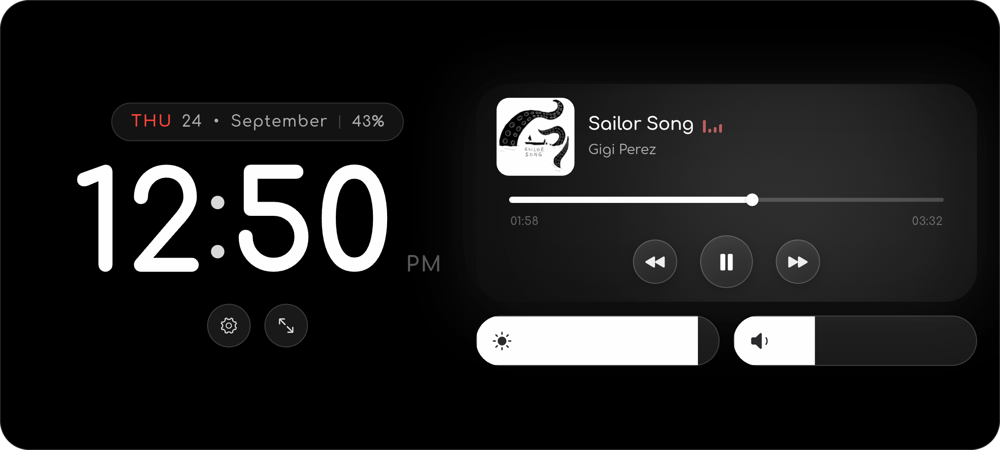
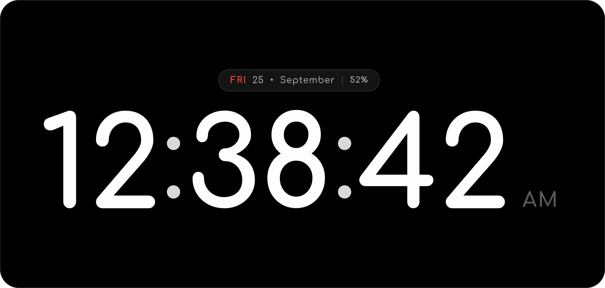

<h1 align="center">DeskTune</h1>

<p align="center">
  <b>Your phone, reimagined as a desk clock and now-playing display.</b><br>
  An Android take on iOS StandBy, in pure OLED black.
</p>

<p align="center">
  <br>
  <sub>Split view: the clock on the left, what's playing on the right.</sub>
</p>

## What is DeskTune?

Prop your phone on a desk or nightstand and DeskTune turns it into a calm,
always-on display: a big clock on one side, and on the other a glass card for
whatever you're listening to. It works with any music or podcast app that shows
Android's media controls, such as Spotify, YouTube Music or Amazon Music, so
there's nothing to sign in to or set up per app.

## Highlights

- **A layout made for a desk.** Clock and now-playing side by side, in landscape
  only, on a true-black background that lets an OLED screen switch its pixels off.
- **Music you can control from across the room.** Album art, title and artist,
  a seek bar, and previous / play-pause / next. The player's own app icon
  sits on the card, and tapping it or the album art jumps straight to that app.
- **A card that matches the song.** The glass tint and glow are drawn from the
  colours of the current album artwork.
- **Brightness and volume, one touch away.** Two slim sliders sit right under the
  card.
- **Clock your way.** It follows your phone's 12- or 24-hour setting (or pick your
  own), you choose whether to show the date and seconds, and the expand button
  opens a full-screen clock.
- **Kind to your screen.** The whole layout drifts a few pixels every minute, so
  the same OLED pixels aren't lit for hours on end.
- **Private by design.** DeskTune asks for no network permission. Track details
  are read on the phone and never leave it.

<p align="center">
  <br>
  <sub>Full-screen clock: tap the expand button to open it, tap anywhere to go back.</sub>
</p>

## Built to stay on all day

A desk display runs for hours, so DeskTune is built to do almost nothing when
nothing is happening. Ambient animation runs only while music plays, and
everything stops when the screen turns off.

| State | CPU use | Frames drawn |
| --- | --- | --- |
| Clock only | about 0.1% of one core | roughly one a minute |
| Music playing | about 26% of one core | 30 per second |
| Screen off or app hidden | 0% | none |

<sub>Measured on a 120&nbsp;Hz Xiaomi phone running Android 14.</sub>

## Get started

You need Android 7.0 or newer and [Flutter](https://docs.flutter.dev/get-started/install).

```sh
flutter pub get
flutter build apk --release --target-platform android-arm64
```

The APK is written to `build/app/outputs/flutter-apk/app-release.apk`. Release
builds are signed with `android/app/release.keystore`, which isn't committed.

### First run: allow media access

DeskTune reads what's playing through Android's **Notification access**. The
welcome screen takes you there. If you installed the APK from a file manager
(rather than the Play Store), Android 13 and newer lock that switch at first, and
the welcome screen shows the fix:

1. Tap **Open App Info**.
2. Turn on **Allow restricted settings** (at the bottom of the page on Xiaomi, or
   in the ⋮ menu on most other phones).
3. Go back, tap **Enable Media Access**, and switch DeskTune on.

That's it. Start any song and it appears on the card.

## Built with

[Flutter](https://flutter.dev) for the interface, plus a small Kotlin layer that
talks to Android's media sessions, volume and battery.
